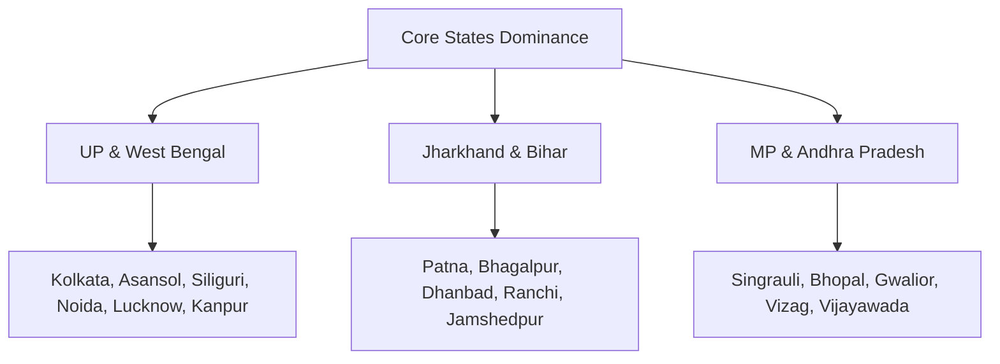

# growth_plan.md

# BestPackersMovers Directory — Business Growth & SEO Strategy Plan

This growth plan outlines the strategy to scale **bestpackersmovers.com** from its initial 24-city directory to a pan-India logistics authority. The goal is to dominate search rankings in the home territories of **National Packers & Movers** (UP, West Bengal, Jharkhand, Bihar, MP, and AP) and funnel high-value relocation leads directly into Chetan Jhampaty's family logistics enterprise.

---

## 1. Targeted Expansion Checklist

We focus programmatic SEO and scraper resources where National Packers & Movers has physical operational hubs and truck fleets.



### Stage 1: Core Territory Dominance (UP, WB, JH, BR, MP, AP)
- [x] **Siliguri, West Bengal** (Hub: North Bengal operations)
- [x] **Bhagalpur, Bihar** (Hub: Eastern Bihar operations)
- [x] **Patna, Bihar** (Hub: Capital city coverage)
- [x] **Dhanbad, Jharkhand** (Hub: Headquarters/Mineral belt operations)
- [x] **Ranchi, Jharkhand** (Hub: Capital city coverage)
- [x] **Lucknow, Uttar Pradesh** (Hub: Central UP operations)
- [x] **Singrauli, Madhya Pradesh** (Hub: Industrial logistics corridor)
- [ ] **Bhopal, Madhya Pradesh** (Next Scraper target)
- [ ] **Visakhapatnam, Andhra Pradesh** (Next Scraper target)

---

## 2. Programmatic SEO Strategy Matrix

To capture high-intent local search traffic, we target three tiers of long-tail queries per city:

| Intent Category | Primary Target Keyword Template | URL Subpath Pattern | Page Layout Priority |
| :--- | :--- | :--- | :--- |
| **High Value** | "Shifting Services in [City]" | `/:city/shifting-services` | Lead Form, Rates Comparison |
| **Rank Focused** | "Top Packers and Movers in [City]" | `/:city/top-packers-and-movers` | Verified Badges, Ratings Table |
| **Price Focused** | "Cheap Packers and Movers in [City]" | `/:city/cheap-packers-and-movers` | Pricing Table, Distance Slider |
| **Local Search** | "Local Packers and Movers in [City]" | `/:city/local-packers-and-movers` | Quick Callback, Local Map |
| **Household** | "House Shifting in [City]" | `/:city/house-shifting` | Household inventory checklists |

### Canonical Schema
To avoid Google's "Duplicate Content" penalty across programmatic page variants:
1. Every subpath variant (e.g. `/patna/shifting-services`) must target a canonical link back to the main city directory page (e.g., `https://bestpackersmovers.com/patna`).
2. The page uses a dynamic intro text matching the keyword search intent.

---

## 3. Lead Conversion & Monetization Pipeline

Captured directory leads are categorized and funneled to maximize profitability.

```
                  [ Customer Shifting Request ]
                                |
                                v
                    [ Filter by Lead Quality ]
                                |
             +------------------+------------------+
             |                                     |
    (High-Value Routes)                     (Low-Value/Off-Route)
             |                                     |
             v                                     v
[ Send to National Packers ]            [ Sell to Local Partners ]
- Household shifts (2BHK+)               - Small local items (1BHK)
- Corporate relocations                  - Off-route destinations
- High margin corridors                  - Generate payout (Rs.200-500/lead)
```

### Partner Verification Model
Local carriers can claim their listing for a verification fee of **₹1,49 activation invoice**. 
- **Unverified (Unclaimed) Listings:** Outbound web links are disabled to prevent page rank leak. Competitor quote forms route leads directly into the directory database.
- **Verified Listings:** Unlocks logo custom styling, gallery image uploads, custom descriptions, and direct WhatsApp contact buttons.

---

## 4. Site Performance & Core Web Vitals Guidelines

Google ranks fast websites higher. We maintain strict frontend limits:
1. **Lightweight CSS:** Compile Tailwind using `--minify`. Avoid massive third-party UI frameworks.
2. **Image Optimization:** All uploaded logos, banner graphics, and gallery images must be compressed to WebP formats.
3. **No Heavy JS:** Keep vanilla JS logic lightweight. Use lazy-loading (`loading="lazy"`) for all off-screen images and maps.
4. **Caching Headers:** Configure Vercel static asset caching for CSS, JS, and image directories.
